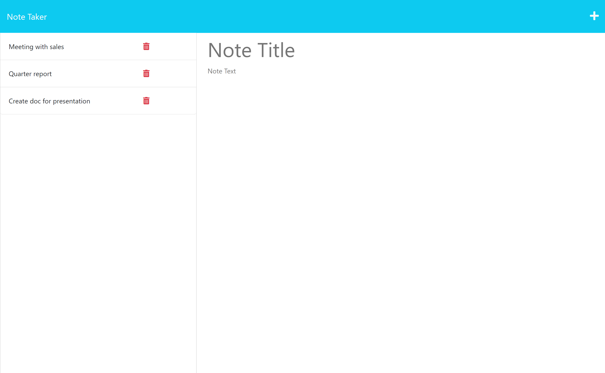
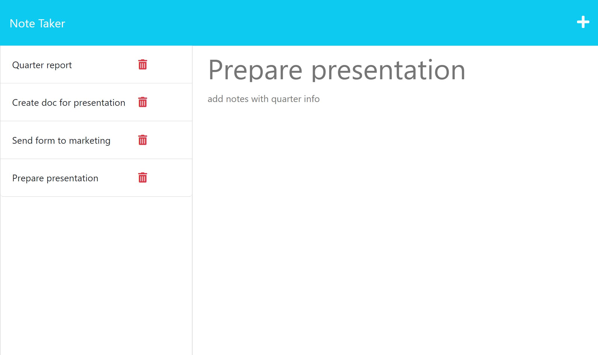

# Note Taker

Note Taker is a simple application that can be used to write, save, and delete notes. This application uses an Express.js back end and saves and retrieves note data from a JSON file.

## Table of Contents
- [Features](#features)
- [Usage](#usage)
- [License](#license)
- [Screenshot and link for the deployed application](#screenshot-and-link-for-the-deployed-application)

## Features
- Create new notes with a title and content.
- View a list of existing notes.
- Delete unwanted notes.

## Usage
The Note Taker application is already deployed and accessible online. You can access it by visiting [Note Taker App](https://XXXXXXXXXXXXXXXXXXXXX).

1. Visit the deployed Note Taker application using the provided URL.
2. You will be presented with the Note Taker application.
3. Click on the "Get Started" button to view the existing notes or create a new note.
4. To create a new note, enter a title and the content in the respective input fields and click the save button.
5. To view a note, click on its title in the list.
6. To delete a note, click on the delete icon next to the note in the list.

## License

This project is licensed under the [MIT License](LICENSE).

## Screenshot and link for the deployed application

[Link deployed application](https://XXXXXXXXXXXX)

